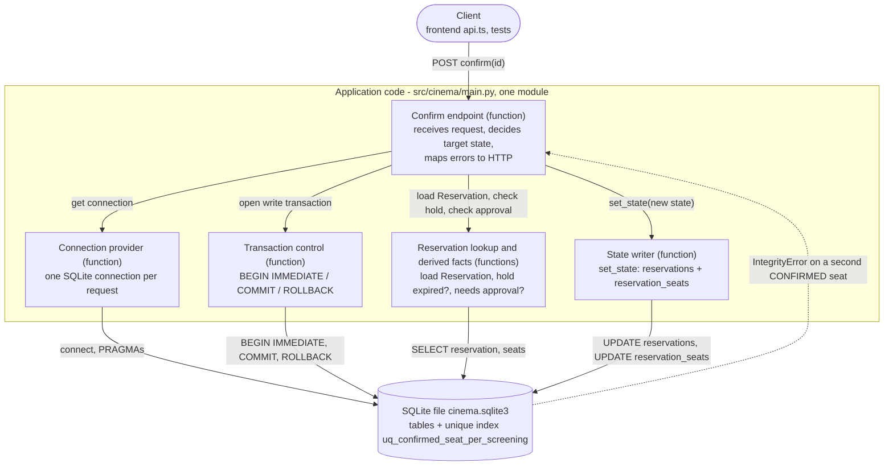

# Architecture and Decisions

Short architecture notes plus the decision records for everything that was a real choice.
Each ADR says what we picked, what it costs, and what would make us change our mind.

## Architecture at a glance

> **This is the C01 target sketch, not what the code is today.** The AS-IS structure of the Confirm scenario is in "C03 - Part A" at the end of this file.

```
          HTTP
   Viewer ────► API layer (FastAPI)
                   │   request/response models, HTTP status mapping
                   ▼
                Domain layer
                   │   Reservation lifecycle, overlap rule, no-orphan rule
                   ▼
                Persistence layer        ──────►  SQLite
                   │   repositories, transactions      ▲
                   │                                   │
                   │                          uq_confirmed_seat_per_screening
                   │                          = the no-double-booking invariant
                   ▼
              NotificationService (boundary, stubbed)
```

Three layers, one outbound boundary. The rule that must never break is enforced at the
bottom, in the database, for the reason recorded in ADR-004.

---

## ADR-001 — The reserved resource is a Seat

**Status:** accepted

**Context.** "Cinema reservation" can be modelled with at least three different resources,
and the choice decides whether the assignment's mandatory rule ("two confirmed reservations
for the same resource must not overlap in time") even applies.

**Decision.** `Resource = Seat` — a physical seat in a hall, occupied for the duration of
the screening it was booked for.

**Alternatives rejected.**

| Alternative | Why not |
|---|---|
| `Resource = Hall`, reservation = a scheduled screening | Makes the user a cinema programmer, not a moviegoer. The interesting domain (seat choice) disappears. |
| `Resource = Screening with capacity`, reservation = N seats | The mandatory rule stops being about time overlap and becomes a capacity rule. Different rule than the one we were asked to model. |

**Consequences.** The overlap rule applies literally and needs no reinterpretation. The
cost is that occupancy must always be *derived* from reservations rather than stored on
the seat, otherwise two sources of truth would drift.

---

## ADR-002 — Python 3.11 + FastAPI + SQLite

**Status:** accepted

**Context.** The brief names Java 21 + Spring Boot + Maven + PostgreSQL as the supported
stack and allows any other stack provided the team supports it themselves and justifies
the choice. This ADR is that justification.

**Decision.** Python + FastAPI + SQLite (via the standard-library `sqlite3` module),
tested with pytest.

**Why.** The team is faster in Python than in Java, and in a course where the deliverable
is a *design* under a *time budget*, framework familiarity converts directly into domain
work. FastAPI gives request validation and an OpenAPI description without extra
machinery. We deviate from the recommended PostgreSQL as well: SQLite is a single file
with no server to install, configure, or containerise, which matters for a team of
students who need to be productive from commit one. It still gives us the one guarantee
ADR-004 depends on — a partial unique index — so nothing about the invariant we care about
is lost by leaving PostgreSQL behind.

**Costs we accept.**

- No compile-time type checking. Mitigation: type hints plus tests around the domain rules.
- We support the stack ourselves; nothing about it is pre-blessed by the course.
- SQLite allows only one writer at a time for the whole database file. Concurrent readers
  are fine, but concurrent confirms serialise on a lock instead of interleaving the way
  they would under PostgreSQL's MVCC. ADR-004's spike measures what this means in practice
  for the no-double-booking invariant.
- SQLite has no native `ENUM` or timezone-aware timestamp type; `schema.sql` uses `TEXT`
  with `CHECK` constraints and ISO-8601 strings instead.

**What would change our mind.** If the selected future pressure (a premiere on-sale burst,
several hundred concurrent confirms) turns out to need real concurrent writers rather than
serialised ones — something the spike in ADR-004 does not test at that scale — moving to
PostgreSQL is still cheap this early: the domain model and all three documents are
stack-independent.

---

## ADR-003 — Hold expiry is evaluated lazily, with no background job

**Status:** accepted

**Context.** A `DRAFT` reservation holds its seats for 15 minutes. Something has to make
the hold stop mattering once it passes.

**Decision.** No scheduler. `hold_until` is compared to the current time whenever a
reservation is read or confirmed. A `DRAFT` row whose hold has passed is treated as
`EXPIRED` and stops occupying its seats.

**Alternative rejected.** A periodic job flipping stale `DRAFT` rows to `EXPIRED`. It buys
no behavioural difference — a hold that nobody observes has no effect either way — and it
adds a scheduler, a failure mode, and an operational thing to monitor.

**Consequences.** The `EXPIRED` state may be *implicit* in the table for a while: a row can
read `DRAFT` while behaving as expired. Every availability query must therefore include the
`hold_until > now()` predicate, and forgetting it in one query is a plausible bug. We accept
that and keep the predicate in a single shared query helper rather than repeating it.

**What would change our mind.** A reporting or analytics need for accurate `EXPIRED`
timestamps, which lazy evaluation cannot provide.

---

## ADR-004 — Double-booking is prevented by a database constraint, not application code

**Status:** accepted — **backed by the C01 engineering spike**

**Context.** Two viewers may confirm the same seat at the same instant. We did not know
whether a `SELECT`-then-write availability check in the application survives that.

**Decision.** The invariant lives in SQLite:

```sql
CREATE UNIQUE INDEX uq_confirmed_seat_per_screening
    ON reservation_seats (screening_id, seat_id)
    WHERE state = 'CONFIRMED';
```

The application's availability `SELECT` is kept for user experience only and is explicitly
**not** a correctness guarantee. `IntegrityError` (`UNIQUE constraint failed`) on confirm
is mapped to **HTTP 409**.

**Evidence.** Measured, not assumed. With the index dropped, two concurrent confirms both
succeeded and the seat was sold twice; with it in place, exactly one succeeded. The
application-level check returned its "seat taken" outcome zero times in either run. Full
transcript and method in [`evidence-and-evolution.md`](evidence-and-evolution.md).

**A wrinkle specific to SQLite.** Unlike PostgreSQL, SQLite only ever lets one connection
hold the write lock, so the two confirms cannot truly interleave — the second writer blocks
until the first commits. The spike shows that this does **not** make the application-level
`SELECT` safe: both threads still read "free" before either one writes, so the outcome the
invariant has to prevent is the same, just reached by a different path (a blocked writer
that then fails the uniqueness check, instead of two writers whose commits race). See
`evidence-and-evolution.md` for what this means for ADR-002's stated cost.

**Alternative rejected.** Pessimistic locking with `SELECT ... FOR UPDATE`-style locking
reads. The spike shows the index alone is sufficient, and SQLite's single-writer model
already serialises writes for us, so explicit locking would only add complexity for no
extra correctness during precisely the premiere burst of our selected future pressure.

**The assumption this rests on.** The index is keyed on `screening_id`, not on a time range.
It is equivalent to the time-based rule in the Project Frame **only while two screenings in
one hall never overlap**. That assumption is recorded in
[`intent-and-change.md`](intent-and-change.md). If overlapping screenings ever become
possible, this index silently stops enforcing the stated rule. SQLite has no exclusion
constraint (PostgreSQL's `EXCLUDE USING gist` is not available here), so the fix would have
to be an application-level check over stored time ranges, done inside the same transaction
as the confirm and re-verified by re-reading under the write lock — a real loss of the
database-level guarantee this ADR currently relies on.

We did not build that now because the situation cannot currently arise, and because it
would reintroduce exactly the "does the check survive concurrency" question this spike was
run to answer.

---

## ADR-005 — `reservation_seats` denormalises `screening_id` and `state`

**Status:** accepted

**Context.** ADR-004 puts the invariant in a unique index. SQLite (like PostgreSQL) cannot
index across two tables, and both columns the index needs live on the parent `reservations`
row.

**Decision.** Copy `screening_id` and `state` onto each `reservation_seats` row.

**Consequences.** This is a genuine denormalisation and we are not pretending otherwise:
every state transition must now write *both* tables, and if one write is forgotten the index
protects the wrong thing. We accept it because the alternative is losing the database-level
guarantee that ADR-004 is built on, and a missed update is a far more visible bug than a
silent double-booking. The transition is confined to a single repository method so there is
exactly one place to get it right — and a database trigger keeping the two in sync is the
obvious hardening if that discipline ever slips.

---

## ADR-006 — The no-orphan rule is evaluated at create, and row ends count as occupied

**Status:** accepted, with a known open question

**Context.** "A reservation must not leave exactly one free seat isolated between occupied
seats in the same row" leaves two things undefined: *when* it is checked, and whether the
end of a row behaves like an occupied neighbour.

**Decision.**

1. Evaluated at **create**, against the Project Frame's definition of *occupied* — so live
   `DRAFT` holds count.
2. **The ends of a row count as occupied.** A single free seat next to the aisle is an
   orphan too.

**Why.** Checking at create tells the viewer the truth at the moment they choose, instead of
accepting their choice and rejecting it at payment time. Counting row ends matches the
commercial reason for the rule — a lone seat at the edge is just as unsellable as a lone
seat in the middle.

**Consequences.** Point 2 has a consequence worth stating plainly: **seat 2 of an
otherwise empty row can never be reserved**, because it strands seat 1. This is intended,
but it is the kind of thing that looks like a bug to someone who has not read this ADR.

Point 1 carries the risk recorded as the Project Frame's *Unknown*: a reservation can be
rejected because of a hold that expires seconds later. We have no data to choose better,
so we picked the option that never shows a viewer a seat map they cannot act on.

**What would change our mind.** Observed false rejections in real use, or a cinema operator
telling us aisle-adjacent singles do sell.

---

## ADR-007 — No frontend in CP1

**Status:** accepted

**Context.** A seat map is the obvious UI for this domain and is tempting to start early.

**Decision.** CP1 delivers the HTTP API and its automated check only. No frontend.

**Why.** The CP1 walking skeleton is defined as `POST /reservations → validate → persist →
return reservation ID → automated check`. A frontend adds a second stack and a second CI
path without advancing any part of that path. It is planned for after the skeleton actually
runs.

**Consequences.** Until then the seat map exists only as the `check availability` response,
and the domain rules are demonstrated by tests rather than by a picture.


---

# C03 — Part A: AS-IS trace of Confirm Reservation

Everything below was checked against the code, a test, or a runtime run. Line numbers refer to
commit `a3e7a8e` (`main`); they will drift when `main.py` changes, the function names will not.
"Runtime trace" means the output of [`docs/trace_confirm.py`](trace_confirm.py) (run `python -X utf8 docs/trace_confirm.py` from the repository root; reservation ids differ between runs because the demo data is random).

## A1. Scenario

| Item | Value |
|---|---|
| Scenario / operation | **OP-03 Confirm Reservation**, including the v0.2 variant "a seat requires approval" |
| Requirements | OP-03 observable requirement(s) in [`operations-specification.md`](operations-specification.md) (that spec numbers operations, not `REQ-xx`) |
| Rules / invariants | **BR-02** exclusive resource (`uq_confirmed_seat_per_screening`, ADR-004); ADR-005 (reservation and seat rows change together); ADR-003 (lazy expiry) |
| Baseline | v0.2 |

## A2. Main success path → code

Files: `src/cinema/main.py` (**M**), `src/cinema/schema.sql` (**S**).

| Step of OP-03 (v0.2) | Realised by | Evidence |
|---|---|---|
| receive the confirm request | route `POST /reservations/{id}/confirm`, function `confirm_reservation`; one SQLite connection per request from `get_db` | M:338-339, M:90-95; caller is `api.confirmReservation` in `src/frontend/src/lib/api.ts:80` |
| begin a transaction that excludes other writers | `write_tx` → `BEGIN IMMEDIATE` | M:42-52, used at M:343 |
| load the Reservation (404 if unknown) | `get_reservation_or_404` → `SELECT * FROM reservations` | M:157-161, called at M:344 |
| check the transition is allowed: still `DRAFT` and hold not passed | `is_expired` (compares `hold_until` with `now()`); `state != "DRAFT"` → 409 | M:164-165, M:345, M:348-349 |
| decide the target state (v0.2) | `needs_approval` (any seat with `requires_approval = 1`) → `PENDING_APPROVAL`, otherwise `CONFIRMED` | M:181-186, M:350-354 |
| change state of the reservation **and** its seats | `set_state` (two `UPDATE`s, sets `confirmed_at` only for `CONFIRMED`) | M:122-127, called at M:352 / M:354 |
| evaluate the seat conflict (BR-02) | **not in application code** — raised by the unique index while the `UPDATE reservation_seats` runs | S:94-96, M:127; see A3 |
| persist | `COMMIT` when the `with write_tx` block ends without an exception | M:52 |
| answer the caller | `{"reservation_id", "state"}` with HTTP 200 | M:359 |
| notify (`NotificationService.reservation_confirmed`) | **absent** — nothing in `src/cinema` mentions a notification | `grep -ri notif src/cinema` finds nothing; see findings |

Tests that exercise this path: `TestConfirm::test_draft_becomes_confirmed_together_with_its_seats`
(tests/test_c02_operations.py:245), `TestConfirmNeedingApproval::test_confirm_on_a_vip_seat_waits_for_a_decision`
(:380).

## A3. Alternative branch: seat conflict → confirmation rejected

| What v0.2 says | Where the condition is detected | Where the outcome is decided | What the caller gets |
|---|---|---|---|
| OP-03: if a seat of this reservation is already `CONFIRMED` for the screening, the write fails, nothing of this reservation becomes `CONFIRMED`, answer `409` | Inside SQLite: the partial unique index `uq_confirmed_seat_per_screening` (S:94-96) rejects `UPDATE reservation_seats SET state='CONFIRMED'` (M:127). There is **no** conflict query in `confirm_reservation` (M:344-354) | The `IntegrityError` leaves the `with write_tx` block → `ROLLBACK` (M:49-51) → caught in `confirm_reservation` (M:355-356) and turned into `HTTPException(409)` | `409 {"detail": "One of the seats was just confirmed by someone else"}`; the loser stays `DRAFT` with `DRAFT` seats |

Runtime trace (two `DRAFT` reservations on the same two seats, confirmed one after the other):

```
first  confirm -> 200 {'reservation_id': 621, 'state': 'CONFIRMED'}
second confirm -> 409 {'detail': 'One of the seats was just confirmed by someone else'}
stored first  : ('CONFIRMED', ['CONFIRMED', 'CONFIRMED'])
stored second : ('DRAFT', ['DRAFT', 'DRAFT'])

replaying set_state() by hand for the loser, statement by statement:
UPDATE reservations       : ok (no error)
UPDATE reservation_seats  : raised IntegrityError - UNIQUE constraint failed: reservation_seats.screening_id, reservation_seats.seat_id
COMMIT                    : reached
```

The last two lines matter: SQLite raises **at the statement**, and a failed statement does **not**
abort the transaction — `COMMIT` still succeeds and would persist the first `UPDATE`
(reservation `CONFIRMED`, seats `DRAFT`). Only the explicit `ROLLBACK` in `write_tx` (M:49-51)
keeps the two tables consistent. Also covered by
`TestConfirm::test_multi_seat_conflict_leaves_no_seat_confirmed` (:283) and
`test_two_simultaneous_confirms_on_one_seat_give_exactly_one_200` (:293).

### Differences between v0.2 and the implementation

| Specification | Implementation | Evidence |
|---|---|---|
| OP-03 step 4: the unique index "is checked at commit" | Checked when the `UPDATE reservation_seats` statement executes; `COMMIT` is not where it fails | runtime trace above; matches C01 evidence item 4 ("fails … before it can commit") |
| OP-03 step 5: after commit, `NotificationService.reservation_confirmed` is called | No such call and no notification code exists | M:338-359 ends with `return`; `grep -ri notif src/cinema` is empty |
| *(C01 sketch, not v0.2)* "Architecture at a glance" above shows an API layer, a domain layer, a persistence layer and a stubbed `NotificationService` | One module. HTTP handling, business rules and SQL sit in the same functions (`confirm_reservation` receives, decides and maps the error) | M:1 ("deliberately one module, plain SQL, no ORM"), M:338-359 |
| *(C01, not v0.2)* ADR-007 "No frontend in CP1" | A React frontend exists and calls this endpoint | `src/frontend/src/lib/api.ts:80` |

## A4. Parts of the implementation that realise the scenario

The application is one module, so the blocks are logical groups of functions, not classes.

| Part (type) | Contains | Role in this scenario | Evidence |
|---|---|---|---|
| **Confirm endpoint** (function) | `confirm_reservation` | receives the request, **decides** the target state, maps failures to HTTP — all in one function | M:338-359 |
| **Transaction control** (function) | `write_tx` | `BEGIN IMMEDIATE` / `COMMIT` / `ROLLBACK`; the single-writer guarantee and the rollback of partial writes | M:42-52 |
| **Reservation lookup & derived facts** (functions) | `get_reservation_or_404`, `is_expired`, `needs_approval`, `now` | load the aggregate, decide "hold still alive" and "needs approval" | M:157-161, M:164-165, M:181-186, M:98-99 |
| **State writer** (function) | `set_state` | writes the new state to `reservations` **and** `reservation_seats` (ADR-005) | M:122-127 |
| **Connection provider** (function) | `get_db`, `connect` | opens the SQLite connection per request, sets `foreign_keys`, WAL, `busy_timeout` | M:90-95, M:32-39 |

Outside the application code: the SQLite file with its schema and the unique index (S:57-96).

## A5. State, state change, and one rule

**State**

| Question | Answer | Evidence |
|---|---|---|
| Where is a Reservation's state stored permanently? | In the SQLite file `cinema.sqlite3` (`DB_PATH`), **twice**: `reservations.state` and a denormalised copy `reservation_seats.state` per seat | M:25; S:61-62, S:80-81; ADR-005 |
| Which code decides and performs the transition used here? | **Decides:** the `if/elif` chain in `confirm_reservation` (expired → `EXPIRED`; not `DRAFT` → 409; needs approval → `PENDING_APPROVAL`; else `CONFIRMED`). **Performs:** `set_state`. The same pair is used by cancel (M:371) and decision (M:388, M:390). | M:345-354, M:122-127 |

**Rule: BR-02 (no two `CONFIRMED` reservations for one seat and screening)**

| Question | Answer | Evidence |
|---|---|---|
| Where is the condition determined? | In the database, by the partial unique index, when a seat row is written as `CONFIRMED` | S:94-96 |
| Where is the outcome decided? | The transaction: any `IntegrityError` → `ROLLBACK` in `write_tx`; the HTTP mapping to 409 in the endpoint | M:49-51, M:355-356 |
| Where is the resulting state change performed? | Nowhere on conflict: the rollback discards both `UPDATE`s. On success `set_state` performs it | runtime trace; M:122-127 |

Several places make this decision: `confirm_reservation` (M:355) and `decide_reservation`
(approve, M:391) each catch `sqlite3.IntegrityError` and map it to 409. Create and cancel do
not rely on the index; create checks "occupied" itself (`OCCUPIED_SEATS_SQL`, M:105-119) inside the
same write lock.

## A6. Dependencies used by this scenario

| Dependency | Where it attaches | Which part knows its technical API | Evidence |
|---|---|---|---|
| SQLite (file database) | `connect()` opens `sqlite3.connect(DB_PATH)`; every SQL statement of the scenario | **All** parts: connection provider, transaction control, lookup functions, state writer, and the endpoint itself (it catches `sqlite3.IntegrityError`) | M:32-39, M:355 |
| System clock | `now()` = `datetime.now(UTC)`, ISO-8601 strings compared as text | lookup functions (`is_expired`), `seed.iso` for the format | M:98-99, M:164-165; `src/cinema/seed.py` (`iso`) |
| Notification Service | specified in OP-03 step 5, **not integrated** | nobody | no code (`grep`) |
| IdP / authentication | none: Confirm does not identify the caller at all | nobody (login by email exists but is not part of this scenario) | M:338-339 has no user parameter |

## A7. AS-IS structural diagram



Blocks and what they contain:

- **Confirm endpoint** (function): `confirm_reservation`
- **Reservation lookup and derived facts** (functions): `get_reservation_or_404`, `is_expired`, `needs_approval`, `now`
- **Transaction control** (function): `write_tx`
- **State writer** (function): `set_state`
- **Connection provider** (functions): `get_db`, `connect`

The dotted arrow is an exception propagating from the database call back through the `with
write_tx` block to the endpoint, not a call made by the database. There is no arrow to a
notification service or an identity provider because this scenario uses neither.
