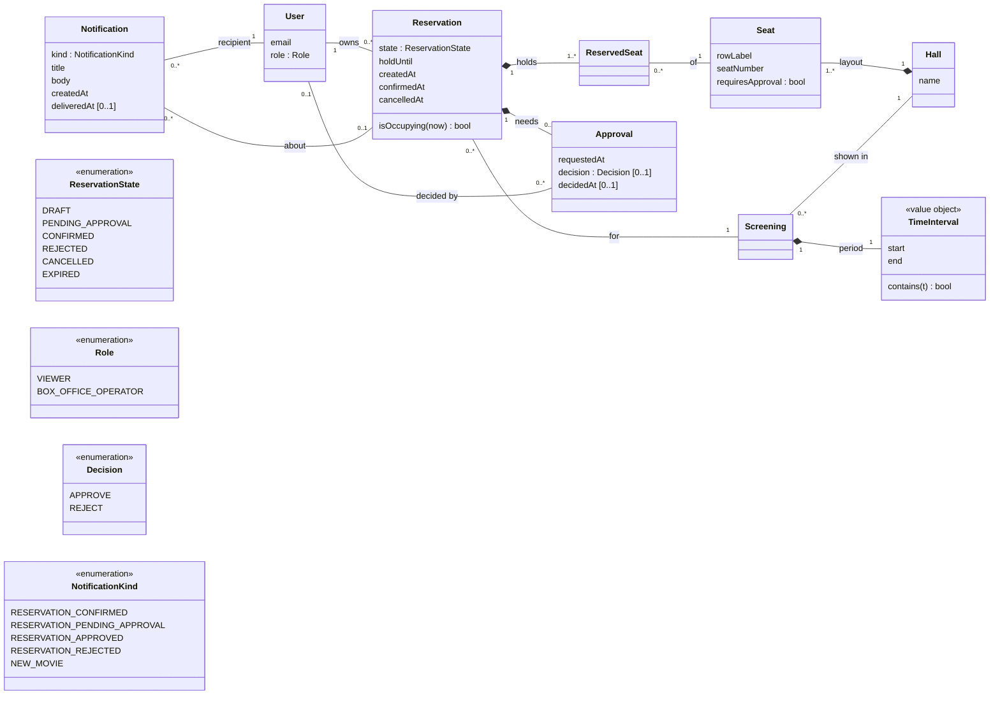

# CV4 — Architecture Drivers, Domain Model, Responsibilities and Decision Question

## Part B — Refined architecture drivers

Starting point: the drivers recorded at the end of C02
([`c02-change-impact.md`](c02-change-impact.md#dopad-změny-c02) and
[`evidence-and-evolution.md`](evidence-and-evolution.md#architectural-drivers-carried-into-c03)),
refined with the findings of the C03 Part A AS-IS trace
([`architecture-and-decisions.md`](architecture-and-decisions.md#c03--part-a-as-is-trace-of-confirm-reservation)).

"Part A Ax" refers to a section of the AS-IS trace; "M:" / "S:" are
lines of `src/cinema/main.py` / `schema.sql` at commit `a3e7a8e`, as used there.

**Code baseline for CV4:** commit `fed5106` (branch `notifications`), which adds the
`NotificationService` that Part A found missing. Part A's other findings are unchanged by it.

Only one driver is new compared with C02 (D2), and it comes directly from a Part A finding.

### Drivers

| Evidence / source | Why it affects architecture | Question architecture must answer |
|---|---|---|
| **D1 — Authoritative conflict decision for exclusive seats**<br>BR-02, OP-03, OP-05; C02 drivers 1 + 2 (evidence) / 2 (impact); C01 spike; Part A A3, A5 (unique index fires at the `UPDATE`, two endpoints each catch `IntegrityError` → 409; `DRAFT` and `PENDING_APPROVAL` are protected only by `OCCUPIED_SEATS_SQL` inside SQLite's global write lock, M:105-119) | Two concurrent requests (confirm/confirm, approve/confirm, create/create) may both observe "no conflict" if the check and the write are separate. Today the only thing that makes BR-02 true is a database constraint for `CONFIRMED` plus one database-wide lock for the other live states — a property of the current stack, not of the design | Where must the authoritative confirmation decision happen so that BR-02 remains true — for `CONFIRMED` **and** for the other occupying states (`DRAFT`, `PENDING_APPROVAL`) — and what must replace the global write lock if writers ever become concurrent? |
| **D2 — One atomic owner of state transitions** *(new, from Part A)*<br>ADR-005 (state stored twice: `reservations.state` + `reservation_seats.state`); Part A A3 runtime trace (`UPDATE reservation_seats` raised, `COMMIT: reached`); Part A A5 (decision in each endpoint's `if/elif`, write in `set_state`, used by confirm, cancel and decision); Part A A8 | SQLite does not abort a transaction on a failed statement; only the explicit `ROLLBACK` in `write_tx` (M:49-51) keeps the two tables consistent. Every endpoint must remember to use `write_tx` + `set_state`; one that does not can leave a reservation `CONFIRMED` with seats `DRAFT`, which the unique index does not see — so D1's guarantee silently breaks | Which single component owns a Reservation's state transitions (allowed transition + both rows + rollback), so that no caller can change state outside it? |
| **D3 — Long-lived pending approval**<br>OP-03 v0.2 variant, OP-05, BR-03; C02 change card ("approval may be delayed, rejected, or expire"); C02 driver 3; ADR-003 (lazy expiry); test "pending approval occupies for hours"; approve-vs-cancel race (C02 mismatch 11) | Approval may arrive hours later, so the state must survive beyond the initiating request and be decided by a different actor in a different request. It can end four ways (approve, reject, cancel, expiry at `starts_at`), two of which can race. Expiry is only evaluated lazily on read; there is no operator work queue | Who owns the pending approval state, who performs the later transition (operator decision, viewer cancel, expiry at screening start), and how does the operator find what is waiting? |
| **D4 — Notification after commit**<br>OP-03 step 5 and its failure outcome ("confirm still returns `200`"), OP-05 step 4; C02 driver 4; Part A A2, A6 (absent at `a3e7a8e`); commit `fed5106`: `notify()` runs after `write_tx` has committed, on its **own connection and transaction**, and logs and swallows every error; `BrowserNotifications` inserts a row into `notifications`; `POST /users/{id}/notifications/deliver` marks rows delivered when it hands them to the browser; `test_failed_notification_never_fails_the_reservation` | Business state is committed before the notification is recorded, in a separate transaction. If that insert fails or the process stops in between, the reservation stays `CONFIRMED` and the message is gone — only a log line remains, and nothing retries. "Delivered" means handed to a browser, not seen by the viewer. The box office is still not told that a decision is waiting (D3), and Cancel and expiry notify nobody. A real e-mail/SMS provider behind the same interface would be slow and failing *inside* the request | Notification failure must not affect confirmation success (spec, now implemented and tested) — so must the message be recorded in the **same transaction** as the state change, and who owns delivery and retry outside the request? Who is notified at each transition, including the box office operator? |
| **D5 — Caller identity and authorisation**<br>OP-05 (`403` for non-operators, *TBD: mechanism*); C02 driver 1 (impact) / 2 (evidence); C02 open items 1, 4; Part A A6 (Confirm has no user parameter; no IdP integration) | OP-05 is the first operation whose outcome depends on *who* calls it, and Confirm/Cancel do not check ownership either. The role check must sit in front of the state transitions of D2/D3, so where it lives determines what every operation's entry point looks like | Where is the caller's identity established, and which component checks "is a box office operator" and "owns this reservation" before a transition is attempted? |


## Part C1 — Domain model (updated)

**Reused:** the *Core concepts* and *Persistent state* of the Project Frame
([`intent-and-change.md`](intent-and-change.md#core-concepts)) — `Seat`, `Reservation`, `User`,
`Screening`, `Hall`. **Updated only where the Confirm scenario (Part A) and drivers D1–D5 need it.**
`Movie` is left out: it only supplies the screening's length and none of the drivers touch it.

Scope: business concepts only. No endpoints, `write_tx`, SQLite tables, the denormalised
`reservation_seats.state` copy (ADR-005) or `NotificationService` implementations — those are
technical realisations of what is drawn here.

### What changed against the Project Frame

| Concept | Status | Change | Driver |
|---|---|---|---|
| `Seat` (Resource) | reused | unchanged; `requiresApproval` already added in v0.2 | — |
| `Screening`, `Hall` | reused | unchanged | — |
| `TimeInterval` | **made explicit** | was the attribute pair `starts_at`/`ends_at`; now a value object with `[start, end)` semantics (BR-01), used by occupancy and expiry | D1, D3 |
| `Reservation` | **updated** | `state` is the *only* state; seats no longer carry a state of their own in the domain | D2 |
| `ReservedSeat` | **made explicit** | was "the set of reserved `seat_id`s"; it is the link Reservation–Seat for one Screening that BR-02 is stated over | D1, D2 |
| `User` | **updated** | gains `role` (`VIEWER`, `BOX_OFFICE_OPERATOR`); the Project Frame had User = viewer only | D5 |
| `Approval` | **new** | the pending decision and its outcome; today implicit in the state `PENDING_APPROVAL` and not stored as anything of its own | D3 |
| `Notification` | **new** | a message to a user about a committed transition; the Project Frame only had the external `NotificationService` boundary. Realised since `fed5106` by the `notifications` table of the browser implementation | D4 |

### Diagram



### Multiplicities with business meaning

| Relationship | Multiplicity | Meaning |
|---|---|---|
| Reservation – ReservedSeat | 1 to 1..\* | One reservation claims one or more seats; an empty reservation does not exist (OP-01 rejects it, `422`) |
| Reservation – Screening | \* to 1 | All seats of one reservation are for the **same** screening |
| ReservedSeat – Seat | \* to 1 | The same seat appears in many reservations over time (cancelled, expired, rejected ones stay); BR-02 restricts how many may be *occupying* at once |
| Reservation – Approval | 1 to 0..1 | An Approval exists only for a reservation that was confirmed with at least one `requiresApproval` seat; at most one, because a decision is final (deciding twice → `409`) |
| Approval – User (decided by) | \* to 0..1 | Empty while pending or when it ended by cancel/expiry; otherwise exactly the operator who decided |
| Notification – Reservation | \* to 0..1 | One reservation produces several messages over its life (pending then approved/rejected, or confirmed); `NEW_MOVIE` notifications are about no reservation. *The `fed5106` table keeps only `user_id` and a rendered text, not the reservation id — the link exists in the domain, not yet in storage* |
| Notification – User (recipient) | \* to 1 | Each message is for exactly one user; a new movie produces one message per user |

### Constraints and invariants

| ID | Constraint | Source | Driver |
|---|---|---|---|
| **BR-02** | For one `Screening` and one `Seat`, at most one `ReservedSeat` whose `Reservation` is `CONFIRMED`. | BR-02, ADR-004 | D1 |
| **INV-1** | Stronger, from the Definition of Occupied: at most one `ReservedSeat` per (`Screening`, `Seat`) whose Reservation `isOccupying(now)` — `CONFIRMED`, `DRAFT` with `now < holdUntil`, or `PENDING_APPROVAL` with `now < screening.period.start`. Today only the `CONFIRMED` part is a database constraint. | Project Frame *Definition of occupied*; C02 driver 2 | D1 |
| **INV-2** | A `ReservedSeat` has no state of its own: its state is always its Reservation's state, changed in one step for the whole Reservation. | ADR-005; Part A A3, A8 | D2 |
| **INV-3** | Every `Seat` of a Reservation belongs to the `Hall` of the Reservation's `Screening`. | OP-01 (`404` other hall) | — |
| **INV-4** | `state = PENDING_APPROVAL` ⇔ an `Approval` exists with no `decision`, and the screening has not started. `APPROVE` ⇒ `CONFIRMED` (subject to BR-02); `REJECT` ⇒ `REJECTED`. Cancel or screening start end it without a decision. | OP-03 v0.2, OP-05, BR-03 | D3 |
| **INV-5** | `Approval.decidedBy.role = BOX_OFFICE_OPERATOR`, and `decidedAt < screening.period.start`. | OP-05 (`403`, `409` after start) | D3, D5 |
| **INV-6** | Confirm and Cancel are performed by the Reservation's owner or a box office operator. *Specified as intent, not enforced today* (Part A A6: Confirm has no caller). | OP-04, C02 open item 1 | D5 |
| **INV-7** | A `Notification` refers only to a transition that has been committed; its existence or delivery never changes the Reservation's state. *Implemented in `fed5106` (`notify()` after commit, errors swallowed) and tested by `test_failed_notification_never_fails_the_reservation`.* | OP-03 failure outcome, OP-05 | D4 |
| **INV-8** | Each `Notification` is delivered to its recipient at most once (`deliveredAt` set when handed over). | `fed5106`, `test_confirm_notifies_the_viewer_once` | D4 |
| **BR-01** | `TimeInterval` is half-open `[start, end)`; a hold ends exactly at `holdUntil`, a screening has started at `start`. | BR-01 | D1, D3 |
| **BR-04** | No orphan seat: creating a Reservation must not leave exactly one free seat between occupied seats (row ends count as occupied). Evaluated at Create only. | BR-04, ADR-006 | — |

## Part C2 — System responsibilities

Same slice as Part A: **OP-03 Confirm Reservation** with its v0.2 variant (a seat requires
approval) and the later transition that completes it, **OP-05 Approve**. Rules: BR-01, BR-02,
BR-03, INV-1 … INV-8 from Part 2. Drivers: D1–D5 from Part 1.

These are responsibilities, not components: nothing here says *which* part of the code owns
them. Today they are all inside `main.py`, and several of them are repeated per endpoint
(Part A A5).

### Responsibilities

| Source | Responsibility | What it must decide / own | Needs one clear owner? | Reason |
|---|---|---|---|---|
| OP-03, OP-04, OP-05 + lifecycle statechart | **R1** — decide whether a lifecycle transition is allowed and what the target state is | the transition rules: `DRAFT` → `CONFIRMED` or `PENDING_APPROVAL` (by `requiresApproval`), `PENDING_APPROVAL` → `CONFIRMED` / `REJECTED`, which states are cancellable, which are terminal | yes | Confirm, Cancel and Decision each have their own `if/elif` today (Part A A5); different parts must not decide differently about the same Reservation |
| BR-02, INV-1, D1 | **R2** — evaluate seat conflict and preserve the exclusivity invariant | the confirmation decision under conflict: "this seat is already `CONFIRMED` / occupied for this screening" → nothing of this reservation is confirmed | yes | two concurrent requests may both observe "no conflict"; today the decision is split between the unique index (`CONFIRMED`) and the global write lock (`DRAFT`, `PENDING_APPROVAL`) |
| ADR-005, INV-2, D2 | **R3** — apply a state change atomically to the Reservation and all its seats | the transaction boundary: both rows change or neither does, including rollback on a failed statement | yes | SQLite commits after a failed statement (Part A A3); any writer that bypasses the rollback leaves a `CONFIRMED` reservation with `DRAFT` seats, invisible to the index |
| BR-01, ADR-003, OP-02, D3 | **R4** — determine time-based facts: hold still alive, screening started, derived `EXPIRED` | "now", the `[start, end)` comparison and the two causes of expiry (hold passed, pending at screening start) | yes | Confirm, Approve, Cancel and Check Availability must agree on the same boundary to the second; lazy expiry means every reader re-derives it |
| C02 change card, OP-05, INV-4, D3 | **R5** — manage pending approval | the approve / reject / expire state that survives the initiating request; the list of what is waiting for the operator; the four ways it can end and their races (approve vs cancel) | yes | the state outlives the request and is completed by a different actor in a different request; without one owner the later transition is decided ad hoc |
| OP-05 (`403`), INV-5, INV-6, D5 | **R6** — identify the caller and authorise the action | who the caller is; "is a box office operator"; "owns this reservation" | yes | a role check that exists in one endpoint and not another is no protection; must happen before R1 is asked |
| OP-03 step 5, OP-05 step 4, INV-7, D4 | **R7** — record that a notification is due after a committed transition | which transition produces which message for whom (viewer; box office still open) | design-dependent | if recorded in the same transaction as R3 it can never be lost and needs R3's owner; if recorded after commit (as in `fed5106`) it can be lost silently |
| Project Frame boundary, INV-8, D4 | **R8** — deliver notifications and retry | delivery to the external channel (browser poll today, e-mail/SMS later), the delivered marker, retry and giving up | design-dependent | external failure must have defined semantics and must never reach back into the reservation (INV-7); whether retry exists at all is a design choice |

### Grouping and separation

| Responsibility | Group with (shares state / invariant) | Separate from (and why) |
|---|---|---|
| **R1** transition rules | R3, R4, R5 — the same Reservation `state`; R1 decides, R3 writes, R4 supplies time facts, R5 is a subset of the transitions | HTTP request/response mapping (different reason to change: protocol); R6 (trust boundary: who may ask is not what is allowed); R8 (external technology) |
| **R2** conflict / exclusivity | R3 — the check and the write must be one indivisible step, or two writers both see "free"; R4 — "occupied" depends on time | the concrete storage mechanism behind it (SQLite index, write lock — external technology, may change with D1); HTTP status mapping |
| **R3** atomic state write | R1, R2 — every transition and its invariant check happen inside it; R7 if notifications are to be durable | R8 (a notification failure must not roll back a sale); connection/driver details of SQLite (external technology) |
| **R4** time facts | R1, R2, R5 — all their rules are stated over BR-01 intervals | the system clock (external, must be replaceable in tests); presentation/time-zone formatting of the frontend |
| **R5** pending approval | R1, R3 — approve/reject/cancel/expire are transitions of the same state; R2 — approval enters `CONFIRMED` through the same invariant | R6 (who is an operator changes with the identity mechanism, not with approval rules); the operator's query/work-queue view (read side, different reason to change); R8 |
| **R6** caller identity & authorisation | — (reads the reservation's owner, owns no reservation state) | R1–R5 (trust boundary and different reason to change: IdP / login technology); must sit in front of them, not inside each endpoint |
| **R7** record notification due | R3 if the message must survive a crash (same transaction); the event that caused it (R1) | R8 — recording "what must be said" is business; sending it is external technology with its own failures |
| **R8** delivery & retry | — (owns only its own delivery state, `deliveredAt`) | R1–R3 (failure boundary: a slow or failing provider must not affect Confirm — INV-7); R7 (different reason to change: channel and provider) |

## Part D — Main decision question


> #### Decision question:
> Today the confirmation decision for BR-02 is made inside SQL: the unique index *uq_confirmed_seat_per_screening* rejects a second CONFIRMED seat, while DRAFT and PENDING_APPROVAL seats are protected only by SQLite's global write lock and by every endpoint remembering to use write_tx + set_state. Should we change it and move the decision into one application-level owner of the Reservation's state transitions, or leave it inside the database and extend it so that the database alone guarantees exclusivity for every occupying state

### Part E1 - Alternatives structural sketch

#### AS-IS — decision split between endpoints and SQL

```
[Reservation Application (main.py)]
  ├─ [confirm endpoint]  ── decides state, catches IntegrityError → 409
  ├─ [decision endpoint] ── decides state, catches IntegrityError → 409
  ├─ [cancel endpoint]   ── decides state
  └─ [create endpoint]   ── checks "occupied" itself
          |  each one: write_tx + set_state (by convention)
          v
[SQLite]
  ├─ unique index        ── BR-02 for CONFIRMED only
  └─ global write lock   ── only thing protecting DRAFT / PENDING_APPROVAL
```

#### Alternative A — move the decision into the application
```
[Reservation Application]
  ├─ [endpoints]                     ── receive request, map outcome to HTTP, no decisions
  |       |
  |       v
  └─ [Reservation Lifecycle]  (NEW)  ── the ONLY writer of Reservation state
        ├─ transition rules (R1)
        ├─ occupancy / conflict check for all states (R2)
        └─ one transaction: reservation + seats (R3)
          |
          v
[SQLite]
  └─ unique index        ── kept only as a backstop or dropped
```


#### Alternative B — keep it in SQL and extend it
```
[Reservation Application]
  └─ [endpoints]         ── unchanged; still decide transitions, map errors to 409
          |
          v
[SQLite]                 ── the authority for exclusivity
  ├─ unique index on CONFIRMED                      (as today)
  ├─ [seat_holds]  (NEW) ── one row per occupying seat,
  |                         UNIQUE (screening, seat) for DRAFT / PENDING_APPROVAL / CONFIRMED
  └─ [triggers]    (NEW) ── keep reservations and reservation_seats in sync,
                            remove holds on cancel / reject / expiry
```

| | What moves | What is new | What disappears |
|---|---|---|---|
| **Alternative A** | transition rules and conflict handling move from each endpoint into one component | `Reservation Lifecycle` component | duplicated `if/elif` and `IntegrityError` → 409 mapping in endpoints |
| **Alternative B** | nothing moves in the application | `seat_holds` table + its unique constraint, sync triggers | reliance on the global write lock and on endpoints remembering `write_tx` |
