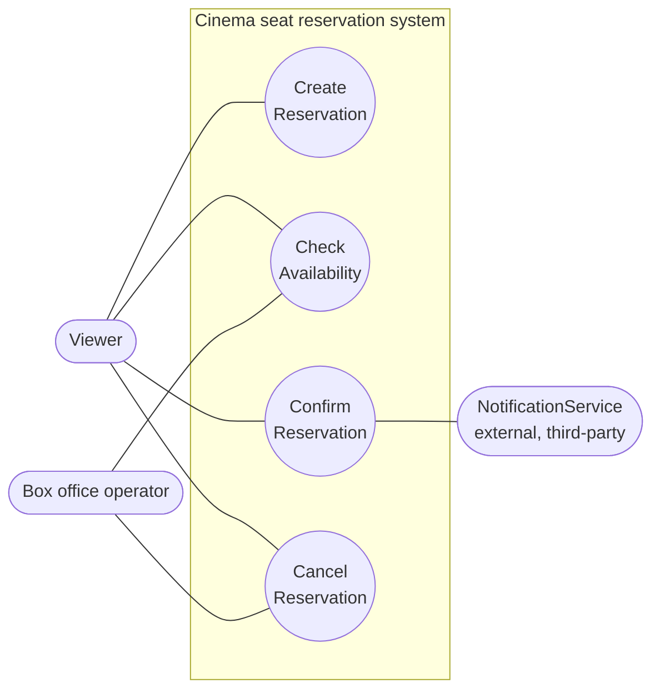
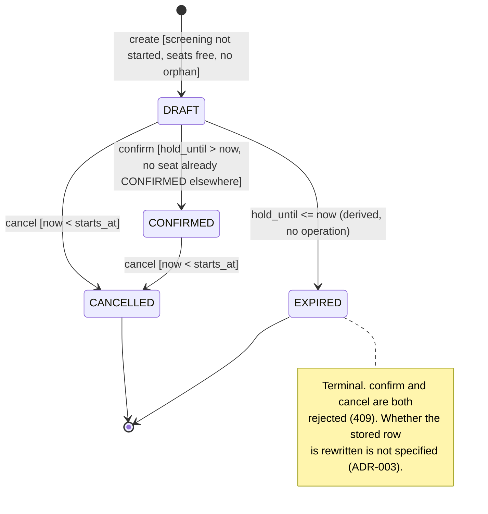
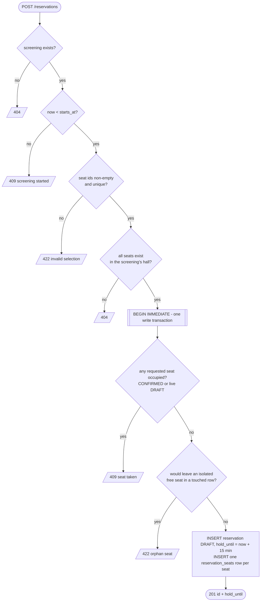
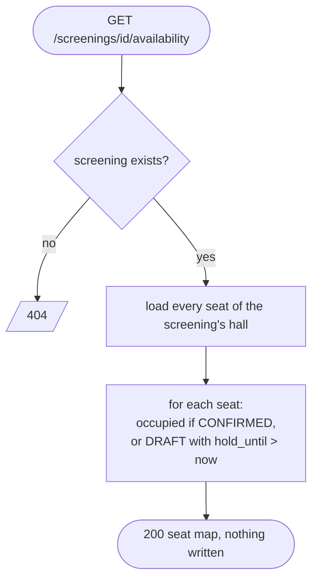
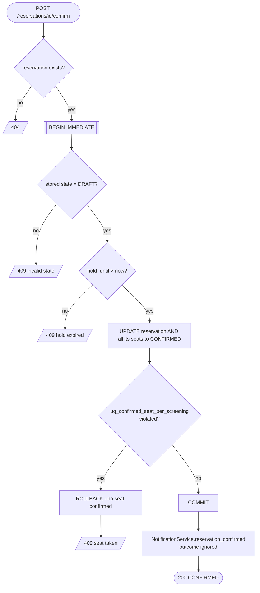
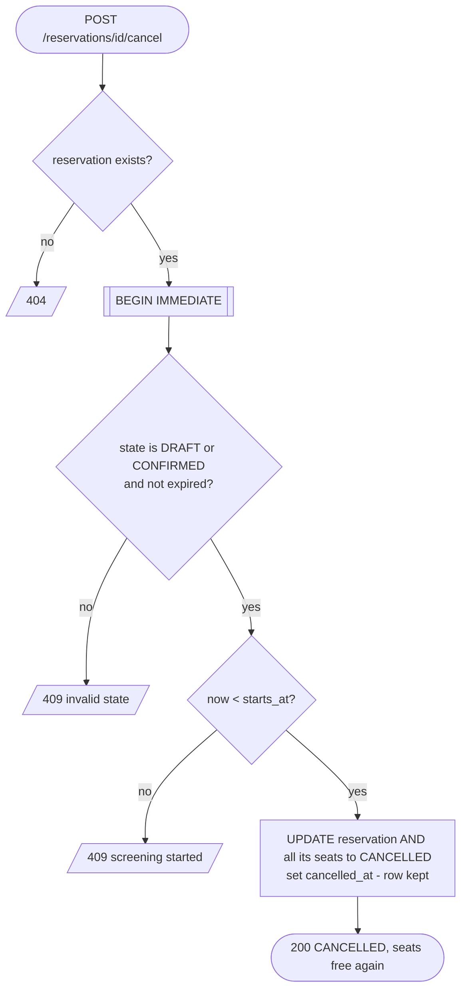

# C02 Diagrams

Three views of the same minimum system, all drawn from
[`operations-specification.md`](operations-specification.md) (which is authoritative — if a
diagram and the text disagree, the text wins and the diagram is a bug). Mermaid, so GitHub
renders them and they diff as text.

**Baseline status: Specification Baseline v0.1 — awaiting team approval.** Nobody has
signed this off yet; tick the box when you have read the spec, `c02-review.md` and these
diagrams and accept them as the baseline.

- [ ] Jan Procházka
- [ ] Jiří Ševeček
- [ ] Šimon Adámek
- [ ] Stanislav Urban

## 1. Use cases — actors and goals

System boundary = the reservation API. Only goals that have a specified operation appear.
The Project Frame also lets a box-office operator "look up a reservation"; that is not one of
the four baseline operations and is deliberately left out until it has an OP slice.

`NotificationService` is drawn because it really exists (Project Frame, external boundary),
and only where the spec makes the call: after a successful Confirm.

| Goal | Actor(s) | Spec |
|---|---|---|
| Create Reservation | Viewer | OP-01 |
| Check Availability | Viewer, Box office operator | OP-02 |
| Confirm Reservation | Viewer (+ NotificationService is called) | OP-03 |
| Cancel Reservation | Viewer, Box office operator (BR-03) | OP-04 |

## 2. Reservation lifecycle — state diagram

`EXPIRED` is **derived, not stored**: a `DRAFT` whose `hold_until` has passed *reads as*
`EXPIRED` (ADR-003). Guards use the half-open conventions of BR-01: `now < starts_at`,
`hold_until > now`.

Rejected requests never change state: every failure path in OP-01..OP-04 leaves the
reservation exactly where it was, so no failure arrows are drawn.

## 3. Activity diagrams — behaviour of each operation

Decision order matches the "Main success scenario" of each OP slice; outcomes are the HTTP
status codes from its "Alternative / failure outcomes" (the spec defines no error-code names).

### OP-01 Create Reservation

### OP-02 Check Availability

### OP-03 Confirm Reservation

### OP-04 Cancel Reservation

## 4. Consistency check

Each edge of the state diagram, traced to the text and to an executed test
(`tests/test_c02_operations.py`).

| Transition / rule | Spec | Test |
|---|---|---|
| `[*] → DRAFT` on create | OP-01 | `TestCreate::test_valid_request_makes_a_draft_with_a_15_minute_hold` |
| create refused after start | OP-01, BR-01 | `TestCreate::test_screening_that_already_started_is_409` |
| `DRAFT → CONFIRMED` | OP-03 | `TestConfirm::test_draft_becomes_confirmed_together_with_its_seats` |
| `DRAFT → CANCELLED` | OP-04, BR-03 | `TestCancel::test_draft_before_start_is_cancelled_and_row_is_kept` |
| `CONFIRMED → CANCELLED` | OP-04, BR-03 | `TestCancel::test_confirmed_before_start_is_cancelled_and_seats_are_free_again` |
| `DRAFT → EXPIRED` (derived) | OP-02 timing example, ADR-003 | `TestAvailability::test_hold_boundary_is_exclusive`, `TestConfirm::test_expired_hold_reads_as_expired_and_holds_no_seats` |
| no arrow out of `CANCELLED` | BR-03 | `TestCancel::test_already_cancelled_is_409`, `TestConfirm::test_cancelled_is_409` |
| no arrow out of `EXPIRED` | BR-03 | `TestCancel::test_expired_is_409`, `TestConfirm::test_expired_hold_is_409` |
| cancel refused after start (both states) | BR-03 | `TestCancel::test_confirmed_after_start_is_409`, `::test_draft_after_start_is_409` |
| one winner among concurrent creates | BR-02, OP-01 | `TestCreate::test_two_simultaneous_creates_on_one_seat_give_exactly_one_201` |
| one winner among concurrent confirms | BR-02, OP-03 | `TestConfirm::test_two_simultaneous_confirms_on_one_seat_give_exactly_one_200` |
| confirm is all-or-nothing | OP-03 | `TestConfirm::test_multi_seat_conflict_leaves_no_seat_confirmed` |
